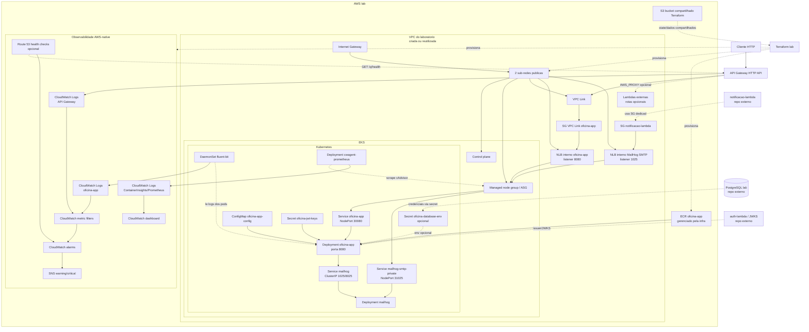

# oficina-k8s-infra

Infraestrutura Terraform e Kubernetes da Oficina com baseline voltado para laboratório acadêmico, priorizando simplicidade operacional e baixo custo.

O projeto provisiona a base da nuvem e converge o cluster do laboratório com:

- VPC enxuta com duas sub-redes públicas para evitar NAT Gateway, criada localmente ou reutilizada do `oficina-infra-db`
- cluster Amazon EKS com managed node group mínimo para laboratório
- repositório Amazon ECR obrigatório para a imagem da aplicação
- API Gateway HTTP API com logs e throttling, pronto para expor app HTTP e Lambdas de forma opcional
- manifests Kubernetes organizados com `kustomize` em `base`, `components` e `overlays`
- telemetria vendor-neutral preparada com logs JSON, OpenTelemetry e probes HTTP no `oficina-app`
- workflows de GitHub Actions separados para validar `develop` e abrir PR para `main`, e para convergir a infraestrutura e os componentes base do cluster após merge em `main`
- workflow manual de GitHub Actions para desativar somente o EKS sem remover VPC, ECR, API Gateway e state remoto

## O que este projeto não cria

- banco de dados PostgreSQL
- VPC privada, NAT Gateway ou topologia de produção
- domínio, CDN ou WAF
- pipeline de build da imagem da aplicação
- migrations de schema da aplicação

## Pré-requisitos

- Terraform `>= 1.6`
- AWS CLI autenticada
- tabela DynamoDB para lock do state, se quiser locking remoto
- `kubectl`
- `jq`
- `openssl`
- imagem da aplicação em um registry acessível pelo cluster

## Estrutura

O repositório segue um layout em diretórios:

- `terraform/modules`: módulos reutilizáveis com os recursos AWS
- `terraform/environments/lab`: root module do ambiente atual, com provider, inputs e outputs
- `k8s/base/oficina-app`: `Deployment` e `Service` base da aplicação
- `k8s/components/mailhog`: componente de e-mail usado no laboratório
- `k8s/overlays/lab-platform`: componentes base do cluster gerenciados por este repositório
- `k8s/overlays/lab-app`: recursos do `oficina-app`
- `k8s/overlays/lab`: composição final do ambiente Kubernetes
- `scripts/actions/`: automações usadas pelos workflows
- `scripts/manual/`: automações de uso manual e operacional
- `scripts/lib/`: helpers compartilhados dos scripts
- `docs/telemetria.md`: convenção de telemetria vendor-neutral da suíte

## Arquitetura dos serviços

O diagrama abaixo resume os serviços criados ou aplicados por este repositório no ambiente `lab` e os principais relacionamentos entre eles. Blocos marcados como opcionais dependem das flags de Terraform ou dos inputs de deploy correspondentes.



## Estado do Terraform

O ambiente `lab` cria por padrão um bucket S3 dedicado aos dados compartilhados do Terraform. Mesmo assim, o bootstrap manual precisa começar com state local:

```bash
terraform -chdir=terraform/environments/lab init
```

Depois do primeiro `apply`, capture o nome do bucket criado:

```bash
terraform -chdir=terraform/environments/lab output terraform_shared_data_bucket_name
```

Em seguida, migre o state para backend remoto S3. Crie um arquivo local a partir do exemplo e reconfigure o `init`:

```bash
cp terraform/environments/lab/backend.s3.tf.example terraform/environments/lab/backend.s3.tf
terraform -chdir=terraform/environments/lab init -migrate-state -force-copy \
  -backend-config="bucket=<bucket-criado>" \
  -backend-config="key=oficina/lab/terraform.tfstate" \
  -backend-config="region=<region>"
```

Se quiser lock remoto, acrescente:

```bash
-backend-config="dynamodb_table=<table>"
```

Para voltar ao state local, remova `terraform/environments/lab/backend.s3.tf` e rode:

```bash
terraform -chdir=terraform/environments/lab init -reconfigure
```

## Configuração

Use `terraform.tfvars.example` como base:

```bash
cp terraform/environments/lab/terraform.tfvars.example terraform/environments/lab/terraform.tfvars
```

Variáveis principais:

- `region`: região AWS do laboratório
- `cluster_name`: nome do cluster EKS
- `shared_infra_name`: prefixo compartilhado da suíte para VPC e bucket S3. Se omitido, usa `cluster_name`; o default efetivo é `eks-lab`
- `kubernetes_version`: versão do Kubernetes. Padrão do projeto: `1.35`
- `eks_cluster_role_arn` e `eks_node_role_arn`: roles preexistentes do laboratório para o control plane e os nodes; por padrão o ambiente `lab` usa as roles do laboratório
- `eks_access_principal_arn`: principal que receberá acesso administrativo ao cluster; se omitido, o Terraform tenta usar a identidade atual
- `instance_type`, `desired_size`, `min_size` e `max_size`: dimensionamento do managed node group
- `reuse_database_network`: quando `true`, tenta reutilizar a VPC compartilhada do `oficina-infra-db` antes de criar rede própria
- `database_identifier`: identificador do RDS usado como sinal de que o `oficina-infra-db` já subiu. Padrão: `oficina-postgres-lab`
- `vpc_id` e `public_subnet_ids`: forçam uma rede específica quando informados
- `create_network_if_missing`, `network_vpc_cidr`, `public_subnet_cidrs` e `azs`: rede mínima criada por este projeto quando não houver rede reutilizável
- `cluster_endpoint_public_access_cidrs`: CIDRs permitidos no endpoint público do EKS
- `ecr_repository_name`: repositório ECR da aplicação. O ambiente `lab` sempre cria e gerencia esse repositório pelo Terraform
- `create_api_gateway`: cria o HTTP API do laboratório. Padrão: `true`
- `api_gateway_enable_detailed_metrics`: habilita métricas detalhadas por rota no HTTP API. Padrão: `true`
- `api_gateway_http_routes`: rotas `HTTP_PROXY` para expor a aplicação principal ou outros backends HTTP
- `api_gateway_lambda_routes`: rotas `AWS_PROXY` para expor Lambdas existentes
- `observability_lambda_function_names`: Lambdas exibidas no dashboard técnico. Padrão: `["oficina-auth-lambda-lab", "oficina-notificacao-lambda-lab"]`; rotas em `api_gateway_lambda_routes` também são incluídas automaticamente
- `api_gateway_vpc_link_subnet_ids`, `api_gateway_vpc_link_security_group_ids` e `api_gateway_create_vpc_link_security_group`: usados apenas quando uma rota HTTP precisar de integração privada via `VPC_LINK`
- `expose_oficina_app_api_gateway`: publica o `oficina-app` na raiz do HTTP API usando `VPC_LINK`, NLB interno e o `NodePort` do Service Kubernetes. Padrão: `true`
- `oficina_app_api_gateway_jwt_authorizer_enabled`: quando `true`, ativa o JWT authorizer nativo do HTTP API nas rotas padrão do `oficina-app`
- `oficina_app_api_gateway_jwt_issuer`: issuer esperado para os access tokens; se omitido, usa o endpoint público do próprio HTTP API
- `oficina_app_api_gateway_jwt_audience`: audience do authorizer. Contrato atual: `["oficina-app"]`
- `oficina_app_api_gateway_jwt_scopes`: scopes exigidos nas rotas protegidas. Padrão e contrato atual: `["oficina-app"]`
- `oficina_app_node_port`: `NodePort` fixo usado como target do NLB interno. Padrão: `30080`, alinhado ao manifesto em `k8s/base/oficina-app`
- `oficina_app_private_listener_port`: porta privada do listener do NLB interno usado pelo API Gateway. Padrão: `8080`
- `expose_mailhog_smtp_private_nlb`: publica o SMTP do MailHog por NLB interno para a `notificacao-lambda`. Padrão: `true`
- `mailhog_smtp_node_port`: `NodePort` fixo do Service `mailhog-smtp-private`. Padrão: `31025`
- `mailhog_smtp_private_listener_port`: porta privada do listener do NLB interno do SMTP do MailHog. Padrão: `1025`
- `notificacao_lambda_security_group_name`: nome do SG dedicado da `notificacao-lambda`. Se omitido, usa `<cluster_name>-notificacao-lambda`
- `create_terraform_shared_data_bucket`, `terraform_shared_data_bucket_name` e `terraform_shared_data_bucket_force_destroy`: bucket S3 usado pelos dados compartilhados do Terraform

## Aplicação da infraestrutura

```bash
terraform -chdir=terraform/environments/lab plan -var-file=terraform.tfvars
terraform -chdir=terraform/environments/lab apply -var-file=terraform.tfvars
```

Saídas principais:

- `cluster_name`
- `cluster_endpoint`
- `kubeconfig_command`
- `ecr_repository_name`
- `ecr_repository_url`
- `api_gateway_endpoint`
- `api_gateway_invoke_url`
- `oficina_app_public_base_url`
- `oficina_app_private_nlb_dns_name`
- `oficina_app_private_nlb_listener_arn`
- `oficina_app_node_port`
- `mailhog_smtp_private_nlb_dns_name`
- `mailhog_smtp_private_listener_port`
- `mailhog_smtp_node_port`
- `notificacao_lambda_security_group_name`
- `notificacao_lambda_security_group_id`
- `terraform_shared_data_bucket_name`
- `vpc_id`
- `public_subnet_ids`
- `network_managed_by_terraform`
- `reused_database_network`

## API Gateway

O ambiente `lab` cria um `API Gateway HTTP API` por padrão porque ele oferece o melhor equilíbrio para laboratório acadêmico: custo por requisição, menor complexidade operacional que o `REST API` e suporte tanto a backends HTTP quanto a Lambda.

Por padrão, o ambiente `lab` publica o `oficina-app` diretamente na raiz do gateway, sem prefixo:

- `ANY /`
- `ANY /{proxy+}`

Essa publicação usa integração privada `VPC_LINK`. O Terraform cria um NLB interno com listener TCP na porta `8080`, registra o Auto Scaling Group do node group EKS em um target group na porta `30080` e configura o HTTP API para usar o listener ARN como `integration_uri`. No Kubernetes, o Service `oficina-app` permanece sem `LoadBalancer` público e usa `type: NodePort` com `nodePort: 30080`, encaminhando para `targetPort: 8080` nos pods.

Para o MailHog, o ambiente `lab` também cria um NLB interno separado para SMTP. O Kubernetes expõe o Service `mailhog-smtp-private` em `NodePort 31025`, e o Terraform publica esse NodePort em um listener TCP privado na porta `1025`, liberado apenas para o security group dedicado da `notificacao-lambda`. Isso mantém o MailHog inacessível pela internet e evita abrir o SMTP para toda a VPC.

O gateway ainda não exige que a aplicação esteja pronta no momento do `apply`: os recursos AWS são criados, mas as chamadas só retornam sucesso depois que o overlay Kubernetes do `oficina-app` estiver aplicado e com endpoints prontos. Para voltar ao comportamento de gateway sem rota padrão, defina:

```hcl
expose_oficina_app_api_gateway = false
```

Quando `oficina_app_api_gateway_jwt_authorizer_enabled = true`, a rota padrão `ANY /` e `ANY /{proxy+}` passa a exigir JWT authorizer nativo do HTTP API com:

- `issuer`: `oficina_app_api_gateway_jwt_issuer` ou, se nulo, o endpoint público do próprio HTTP API
- `audience`: `["oficina-app"]`
- `scope`: `["oficina-app"]` por padrão

Nesse modo, a exposição do `oficina-app` fica em deny by default no gateway. Permanecem públicas apenas as exceções necessárias para a suíte atual:

- `GET /q/swagger-ui`
- `GET /q/swagger-ui/`
- `GET /q/swagger-ui/{proxy+}`
- `GET /q/health/live`
- `GET /q/health/ready`
- `GET /ordem-de-servico/{id}/acompanhar-link`
- `GET|POST /ordem-de-servico/{id}/aprovar-link`
- `GET|POST /ordem-de-servico/{id}/recusar-link`

`/q/openapi` não fica público quando a flag está ativa.

Para a aplicação principal, há dois padrões suportados:

- rota HTTP pública, usando `HTTP_PROXY` com uma URL já publicada
- rota privada, usando `HTTP_PROXY` com `connection_type = "VPC_LINK"` e `integration_uri` apontando para um listener ARN de ALB ou NLB

Para Lambdas, use `api_gateway_lambda_routes`. Quando `function_name` também for informado, o Terraform cria a permissão `aws_lambda_permission` para o API Gateway invocar a função.

Exemplo mínimo com app HTTP pública e um Lambda:

```hcl
api_gateway_http_routes = {
  "ANY /app" = {
    integration_uri = "https://app-lab.exemplo.edu.br/app"
  }
  "ANY /app/{proxy+}" = {
    integration_uri = "https://app-lab.exemplo.edu.br/app/{proxy}"
  }
}

api_gateway_lambda_routes = {
  "POST /payments" = {
    invoke_arn    = "arn:aws:lambda:us-east-1:123456789012:function:payments:live"
    function_name = "arn:aws:lambda:us-east-1:123456789012:function:payments:live"
  }
}
```

Se a aplicação principal for publicada por ALB privado, troque a rota HTTP por:

```hcl
api_gateway_http_routes = {
  "ANY /app" = {
    integration_uri = "arn:aws:elasticloadbalancing:us-east-1:123456789012:listener/app/oficina/abc123/def456"
    connection_type = "VPC_LINK"
  }
  "ANY /app/{proxy+}" = {
    integration_uri = "arn:aws:elasticloadbalancing:us-east-1:123456789012:listener/app/oficina/abc123/def456"
    connection_type = "VPC_LINK"
  }
}
```

Nesse caso, use o output `api_gateway_vpc_link_security_group_id` para liberar entrada no ALB a partir do VPC Link.

Com a rota padrão do `oficina-app`, o teste público usa o output `oficina_app_public_base_url`:

```bash
API_URL="$(terraform -chdir=terraform/environments/lab output -raw oficina_app_public_base_url)"
curl -i "${API_URL}/q/swagger-ui/"
curl -i "${API_URL}/q/openapi"
curl -i "${API_URL}/q/health/live"
curl -i "${API_URL}/q/health/ready"
curl -i "${API_URL}/ordem-de-servico/2b2276e8-fa72-4f4c-a3b0-2c5b1bf427ef/acompanhar-link?actionToken=<magic-link>"
curl -i -H "Authorization: Bearer <jwt-valido>" "${API_URL}/ordem-de-servico"
```

## Observabilidade

O repositório mantém duas camadas complementares de observabilidade:

- a convenção vendor-neutral da suíte, preservada em [docs/telemetria.md](docs/telemetria.md)
- a implantação AWS-native do `lab`, descrita em [docs/observabilidade-aws.md](docs/observabilidade-aws.md)

- logs estruturados em JSON no app
- OpenTelemetry habilitado para tracing e propagação de contexto
- métricas de negócio e técnicas expostas pelo app
- probes Kubernetes em `GET /q/health/live` e `GET /q/health/ready`
- env vars OTEL e `OFICINA_OBSERVABILITY_*` padronizadas no `ConfigMap`
- dashboards separados para métricas negociais e técnicas, incluindo latência agregada e por rota, 5xx, consumo k8s agrupado por serviço, métricas de Lambdas, healthchecks e uptime
- alarmes de latência agregada e por rota, 5xx, falhas de integração, falhas de processamento de OS e healthchecks
- correlação entre access logs do gateway e logs JSON do backend por `X-Request-Id`/`request_id`

Contratos e arquitetura:

- [docs/telemetria.md](docs/telemetria.md)
- [docs/observabilidade-aws.md](docs/observabilidade-aws.md)

## Deploy da aplicação

Se o projeto externo do banco criar o secret `oficina-database-env` no namespace `default`, o deploy da aplicação o reutiliza automaticamente. Se esse secret não existir, o deploy segue normalmente sem carregar variáveis de banco.

Exemplo:

```bash
kubectl create secret generic oficina-database-env \
  --namespace default \
  --from-env-file=<caminho-para-o-env-do-banco>
```

Depois aplique a aplicação:

```bash
IMAGE_REF=<registry>/oficina:<tag> \
./scripts/manual/deploy-manual.sh
```

O script:

- aplica sempre o overlay `k8s/overlays/lab-platform`
- reutiliza o secret `oficina-database-env` quando ele existir, apenas quando `IMAGE_REF` for informado
- reutiliza chaves JWT em `JWT_DIR`; se ausentes, gera um par local, apenas quando `IMAGE_REF` for informado
- aplica o overlay `k8s/overlays/lab-app` somente quando `IMAGE_REF` for informado

Para acesso local:

```bash
./scripts/manual/start-port-forwards.sh
```

Por padrão, o script usa `EKS_CLUSTER_NAME=eks-lab` e `UPDATE_KUBECONFIG=auto`, atualizando o kubeconfig quando o endpoint local estiver diferente do endpoint ativo do EKS.

## Deploy com GitHub Actions

O repositório mantém três workflows para o ambiente de laboratório:

- [`.github/workflows/open-pr-to-main.yml`](.github/workflows/open-pr-to-main.yml): valida `develop` e abre ou atualiza o PR automático para `main`
- [`.github/workflows/deploy-lab.yml`](.github/workflows/deploy-lab.yml): valida o repositório, aplica a infraestrutura Terraform e converge os componentes base do cluster no EKS
- [`.github/workflows/destroy-lab.yml`](.github/workflows/destroy-lab.yml): remove a infraestrutura completa criada pelo repositório para zerar o custo recorrente do laboratório quando ele não estiver em uso

O workflow `Open PR To Main` executa em pushes para `develop`. Ele valida formatação Terraform, inicialização/validação Terraform sem backend, renderização dos overlays Kubernetes e sintaxe dos scripts shell. Depois que a validação passa, ele abre ou atualiza um pull request para `main` quando houver diferença real de conteúdo entre as branches. Merges reversos de `main` para `develop` sem mudança de arquivos não geram novo PR.

O workflow `Deploy Lab` executa em pushes para `main` e por `workflow_dispatch`. O job `validate` roda antes do deploy, e a execução manual também deve ser feita a partir de `main`.

No deploy em `main`, o workflow executa `scripts/actions/ci-deploy.sh`. Esse script aplica o Terraform, garante a atualização dos dashboards CloudWatch de observabilidade quando habilitados, atualiza o kubeconfig do EKS e aplica sempre o overlay `k8s/overlays/lab-platform`, que inclui MailHog e observabilidade. O deploy da aplicação roda em modo automático: se `IMAGE_REF` for informado, se `IMAGE_TAG` existir no ECR ou se houver uma tag recente no ECR configurado, o script aplica `k8s/overlays/lab-app` e prepara os secrets de JWT e banco quando necessário; se não houver imagem disponível, ele mantém somente a plataforma.

Quando esse deploy termina com sucesso, o workflow dispara o `deploy-lab.yml` do repositório `oficina-infra-db` por `workflow_dispatch`. O disparo é assíncrono: este workflow não espera o deploy do banco finalizar e também não falha se o comando de disparo encontrar erro. Por default, o destino é `<owner>/oficina-infra-db` na ref `main`.

Os jobs usam o GitHub Environment `lab` para centralizar `vars` e `secrets`.

Os workflows também aceitam `organization secrets/variables` e `repository secrets/variables` com os mesmos nomes. O GitHub resolve isso por precedência: `environment` sobrescreve `repository`, que sobrescreve `organization`.

O acesso à AWS é feito com credenciais clássicas do AWS CLI expostas como variáveis de ambiente do job, porque esse é o caminho mais simples para o laboratório atual.

Valores esperados no Environment:

- `AWS_REGION`
- `EKS_CLUSTER_NAME`
- `IMAGE_REF` ou `IMAGE_TAG`: imagem da aplicação. Se ambos forem omitidos, o workflow tenta usar a tag mais recente do ECR configurado
- `AWS_ACCESS_KEY_ID`: credencial AWS em `secrets`
- `AWS_SECRET_ACCESS_KEY`: credencial AWS em `secrets`
- `AWS_SESSION_TOKEN`: opcional, mas necessário quando o laboratório entregar credenciais temporárias

Valores opcionais no Environment:

- `EKS_ACCESS_PRINCIPAL_ARN`
- `EKS_CLUSTER_ROLE_ARN`
- `EKS_NODE_ROLE_ARN`
- `EKS_AZS`: lista JSON, por exemplo `["us-east-1a","us-east-1b"]`
- `EKS_PUBLIC_SUBNET_CIDRS`: lista JSON, por exemplo `["10.0.0.0/20","10.0.16.0/20"]`
- `EKS_CLUSTER_ENDPOINT_PUBLIC_ACCESS_CIDRS`: lista JSON de CIDRs
- `ECR_REPOSITORY_NAME`
- `API_GATEWAY_NAME`
- `API_GATEWAY_VPC_LINK_SUBNET_IDS`: lista JSON de subnets
- `API_GATEWAY_VPC_LINK_SECURITY_GROUP_IDS`: lista JSON de security groups
- `API_GATEWAY_HTTP_ROUTES`: objeto JSON compatível com `api_gateway_http_routes`
- `API_GATEWAY_LAMBDA_ROUTES`: objeto JSON compatível com `api_gateway_lambda_routes`
- `API_GATEWAY_JWT_AUTHORIZERS`: objeto JSON compatível com `api_gateway_jwt_authorizers`
- `OFICINA_APP_API_GATEWAY_JWT_AUTHORIZER_ENABLED`: default `false`; quando `true`, protege as rotas padrão da aplicação com JWT
- `OFICINA_APP_API_GATEWAY_JWT_ISSUER`: issuer do authorizer; quando ausente, usa o endpoint público do próprio HTTP API
- `OFICINA_AUTH_ISSUER`: issuer repassado ao ConfigMap da aplicação; quando ausente no deploy integrado, é derivado do endpoint do API Gateway
- `OFICINA_AUTH_JWKS_URI`: JWKS repassado ao ConfigMap da aplicação; quando ausente no deploy integrado, é derivado de `OFICINA_AUTH_ISSUER`
- `OFICINA_AUTH_FORCE_LEGACY`: default `false`; quando `true`, preserva explicitamente o modo legado `oficina-api` + `file:/jwt/publicKey.pem`
- `TERRAFORM_SHARED_DATA_BUCKET_NAME`
- `TF_STATE_BUCKET`
- `TF_STATE_KEY`
- `TF_STATE_REGION`
- `TF_STATE_DYNAMODB_TABLE`
- `REGENERATE_JWT`: default `false`; use `true` apenas para rotacionar explicitamente chaves locais
- `ROTATE_JWT_SECRET`: default `false`; quando `true`, rotaciona o secret JWT no Secrets Manager
- `FETCH_RUNTIME_SECRETS_FROM_AWS`
- `K8S_DATABASE_SECRET_ID`
- `K8S_JWT_SECRET_ID`: default `oficina/lab/jwt`; usado para criar/reutilizar o par JWT compartilhado com o `oficina-auth-lambda`
- `K8S_JWT_SECRET_KMS_KEY_ID`: KMS key opcional para criação do secret JWT
- `OFICINA_DB_REPOSITORY`: repositório alvo para disparar o deploy do banco; default `<owner>/oficina-infra-db`
- `OFICINA_DB_WORKFLOW_REF`: ref usada no `workflow_dispatch` do banco; default `main`

Secrets opcionais:

- `K8S_DATABASE_ENV_FILE`: conteúdo `.env` usado para criar ou atualizar o secret Kubernetes `oficina-database-env`
- `OFICINA_DB_WORKFLOW_TOKEN`: token usado para disparar o workflow do `oficina-infra-db` quando o `GITHUB_TOKEN` deste repositório não tiver acesso ao repo alvo
- `OFICINA_WORKFLOW_TOKEN`: token compartilhado opcional para disparar workflows em repositórios irmãos quando o token específico não estiver configurado

O secret de banco deve informar `QUARKUS_DATASOURCE_REACTIVE_URL` ou conter dados suficientes para o deploy montar essa URL automaticamente. Formatos aceitos:

- `.env`/JSON com `QUARKUS_DATASOURCE_REACTIVE_URL`, `QUARKUS_DATASOURCE_USERNAME` e `QUARKUS_DATASOURCE_PASSWORD`
- `.env`/JSON com `quarkus.datasource.reactive.url`, `quarkus.datasource.username` e `quarkus.datasource.password`
- `.env`/JSON com `DATABASE_URL`, `DB_URL`, `POSTGRES_URL`, `POSTGRESQL_URL`, `QUARKUS_DATASOURCE_JDBC_URL` ou `SPRING_DATASOURCE_URL`
- JSON comum do Secrets Manager/RDS com `host`, `port`, `dbname`, `username` e `password`

Se o laboratório recriar as credenciais a cada nova sessão, atualize os `secrets` `AWS_ACCESS_KEY_ID`, `AWS_SECRET_ACCESS_KEY` e, quando houver, `AWS_SESSION_TOKEN` antes do merge que vai disparar o deploy.

Se `TF_STATE_BUCKET` apontar para um bucket que ainda não existe, o script de CI faz o bootstrap automaticamente com state local, cria o bucket, migra o state para o backend S3 e segue a execução.

Se `TF_STATE_BUCKET` apontar para um bucket que já existe, o workflow reutiliza esse bucket normalmente. Quando o bucket já estiver no state desse ambiente, ele continua gerenciado pelo Terraform; quando for um bucket externo preexistente, o workflow apenas o utiliza como backend remoto sem tentar recriá-lo.

Se `TF_STATE_BUCKET` não for informado, o script deriva automaticamente o nome do bucket compartilhado a partir de `shared_infra_name`/`cluster_name`, da conta AWS e da região. Se necessário, ele faz bootstrap com state local e migra o state para esse backend remoto S3.

Quando o bucket existe, mas o state remoto deste repositório ainda não, o script continua bloqueando recursos órfãos de EKS/API Gateway. A exceção é a rede compartilhada criada pelo `oficina-infra-db`: se a VPC `<shared_infra_name>-vpc` tiver o security group `<database_identifier>-sg` e não houver sinais de EKS/API Gateway deste repo na mesma VPC, o bootstrap segue e o Terraform reutiliza essa rede.

O workflow:

- valida formatação Terraform, inicialização/validação Terraform sem backend, renderização do overlay Kubernetes e sintaxe dos scripts shell
- inicializa e aplica o Terraform em `terraform/environments/lab`
- faz bootstrap do backend S3 quando necessário e migra o state para o backend remoto
- atualiza o kubeconfig do EKS e aplica a oficina com suas dependências Kubernetes, incluindo MailHog

O workflow `Open PR To Main` mantém a promoção `develop` -> `main` separada do deploy, seguindo o mesmo padrão usado no `oficina-app`.

## Operações manuais de Terraform

Use o workflow `Deploy Lab` quando quiser convergir a infraestrutura declarada neste repositório.

Use o workflow `Deactivate EKS Lab` quando quiser remover somente o EKS durante períodos de inatividade. Ele exige o valor `DEACTIVATE` no campo de confirmação e executa um `terraform destroy` direcionado ao alvo `module.eks`, preservando VPC, ECR, API Gateway e bucket de state.

O workflow `Deactivate EKS Lab` exige state remoto existente. Rode `Deploy Lab` pelo menos uma vez antes de usá-lo.

Use o workflow `Destroy Lab` quando quiser desmontar a suíte inteira do laboratório. Antes do `terraform destroy` deste repositório, ele remove também os recursos AWS criados pelos fluxos dos repositórios irmãos `oficina-auth-lambda` e `oficina-infra-db`, para evitar que ENIs de Lambda ou o RDS prendam a VPC compartilhada.

O `Destroy Lab` remove, quando existirem:

- `auth-lambda` e `notificacao-lambda`, seus log groups, o log group legado `/aws/lambda/OficinaAuthLambdaNative` e o security group dedicado do `auth-lambda`
- RDS PostgreSQL do laboratório, log groups, alarmes, parameter group, subnet group, security group e role de enhanced monitoring
- secrets runtime compartilhados da suíte no Secrets Manager, como `oficina/lab/jwt`, `oficina/lab/database/app`, `oficina/lab/database/auth-lambda` e seus sub-secrets, quando `delete_runtime_secrets=true`
- objetos de artefato das Lambdas no bucket S3 configurado, quando `delete_lambda_artifact_objects=true`

Antes de apagar as Lambdas, o cleanup remove a associação VPC delas para acelerar a liberação das ENIs. Se algum security group continuar preso por ENIs da AWS, o workflow continua limpando os demais recursos da suíte, deixa o `terraform destroy` avançar e, se necessário, roda um novo cleanup seguido de uma nova tentativa de destroy. Os tempos são configuráveis por `NETWORK_INTERFACE_WAIT_SECONDS` e `FINAL_NETWORK_INTERFACE_WAIT_SECONDS`.

Depois disso, o workflow destrói, quando gerenciados por este repositório/state:

- VPC, subnets públicas, internet gateway, route table e associações
- cluster EKS, managed node group, access entry e access policy association
- security groups dedicados, NLBs internos, listeners, target groups e attachments
- API Gateway HTTP API, stage, integrações, rotas, JWT authorizers, VPC Link e access log group
- stack de observabilidade AWS-native: log groups, metric filters, alarmes, dashboards, tópicos SNS, subscriptions e health checks do Route 53
- repositório ECR gerenciado por este ambiente, mesmo com imagens
- bucket S3 compartilhado do Terraform quando ele faz parte do state deste ambiente, mesmo com objetos/versionamento

Durante o destroy, o script diferencia state local temporário criado pela própria migração do backend de arquivos locais avulsos. Isso evita prompts de migração no `terraform init` com `-input=false` e permite que uma segunda tentativa continue de forma determinística depois de uma falha parcial. Quando o bucket de backend faz parte deste state, o script preserva uma cópia remota do state, remove temporariamente o bucket do state local de destroy e só esvazia/remove o bucket versionado depois que a infraestrutura foi destruída. Antes do `terraform destroy`, o script também remove explicitamente as imagens do ECR para evitar falha de exclusão por repositório não vazio.

Para zerar custo de armazenamento do banco, o input `skip_final_db_snapshot` fica disponível no workflow. Com o default `true`, o RDS é removido sem snapshot final.

O input `delete_shared_state_bucket` controla a remoção do bucket S3 compartilhado de state ao final do destroy. Com o default `false`, o workflow preserva esse bucket quando ele é backend externo ou compartilhado por outros states da suíte. Quando `true`, ele apaga o bucket inteiro, incluindo versionamento e todos os states remotos armazenados nele.

O workflow preserva recursos externos que o laboratório apenas reutiliza, como bucket de backend remoto fora do state, salvo quando `delete_shared_state_bucket=true`. Se o ECR configurado já existir fora do state, o script o importa para que passe a ser gerenciado por este ambiente antes do apply/destroy completo.

## Validações recomendadas

```bash
terraform fmt -check -recursive terraform
terraform -chdir=terraform/environments/lab validate
kubectl kustomize k8s/overlays/lab-platform >/tmp/oficina-lab-platform-rendered.yaml
kubectl kustomize k8s/overlays/lab-app >/tmp/oficina-lab-app-rendered.yaml
kubectl kustomize k8s/overlays/lab >/tmp/oficina-lab-rendered.yaml
find scripts -type f -name '*.sh' -print0 | xargs -0 bash -n
```

## Perfil de custo

Padrões pensados para laboratório acadêmico:

- duas sub-redes públicas
- sem NAT Gateway
- managed node group mínimo
- `t3.medium` por padrão
- repositório ECR
- API Gateway HTTP API com logs e throttling padrão
- MailHog dentro do cluster

Esses padrões preservam:

- separação entre infraestrutura da aplicação e infraestrutura do banco
- deploy reproduzível via Terraform e `kustomize`
- publicação automatizada em branch protegida
- custo mais baixo que uma topologia de produção
